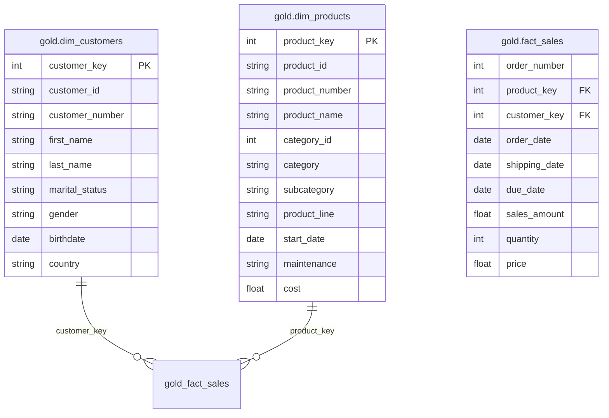

# 📊 Data Model (Star Schema)

## 🗂️ Tables  

| Table | Column Name | Description / Notes |
|-------|-------------|----------------------|
| **gold.dim_customers** | **PK customer_key** | Primary Key |
|  | customer_id | Source system customer ID |
|  | customer_number | Customer reference number |
|  | first_name | First name |
|  | last_name | Last name |
|  | marital_status | Married / Single |
|  | gender | Gender |
|  | birthdate | Date of birth |
|  | country | Customer country |
| **gold.fact_sales** | order_number | Sales order number |
|  | **FK1 product_key** | Foreign key → dim_products |
|  | **FK2 customer_key** | Foreign key → dim_customers |
|  | order_date | Date of order |
|  | shipping_date | Shipping date |
|  | due_date | Due date |
|  | sales_amount | Sales amount |
|  | quantity | Quantity ordered |
|  | price | Unit price |
|  | **Sales Calculation** | `Sales = Quantity * Price` |
| **gold.dim_products** | **PK product_key** | Primary Key |
|  | product_id | Source system product ID |
|  | product_number | Product reference number |
|  | product_name | Product name |
|  | category_id | Category ID |
|  | category | Category name |
|  | subcategory | Subcategory name |
|  | product_line | Product line |
|  | start_date | Start date |
|  | maintenance | Yes/No |
|  | cost | Product cost |

---

## 📌 ERD (Entity Relationship Diagram)  

---

## 📌 Explanation  

This is a **Star Schema** design where:  
- **Fact Table (fact_sales):** Stores transactional data such as sales, order details, and metrics.  
- **Dimension Tables (dim_customers, dim_products):** Store descriptive attributes related to customers and products.  
- The **fact table links to dimensions** via foreign keys, allowing detailed analysis by attributes like product category, customer demographics, and time.  

This structure is optimized for **BI & Reporting, Ad-hoc Analysis, and Machine Learning use cases**.  
